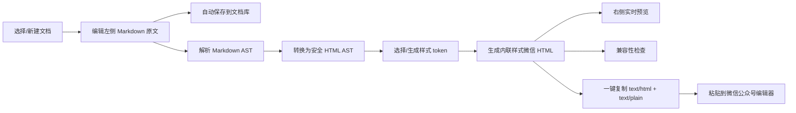
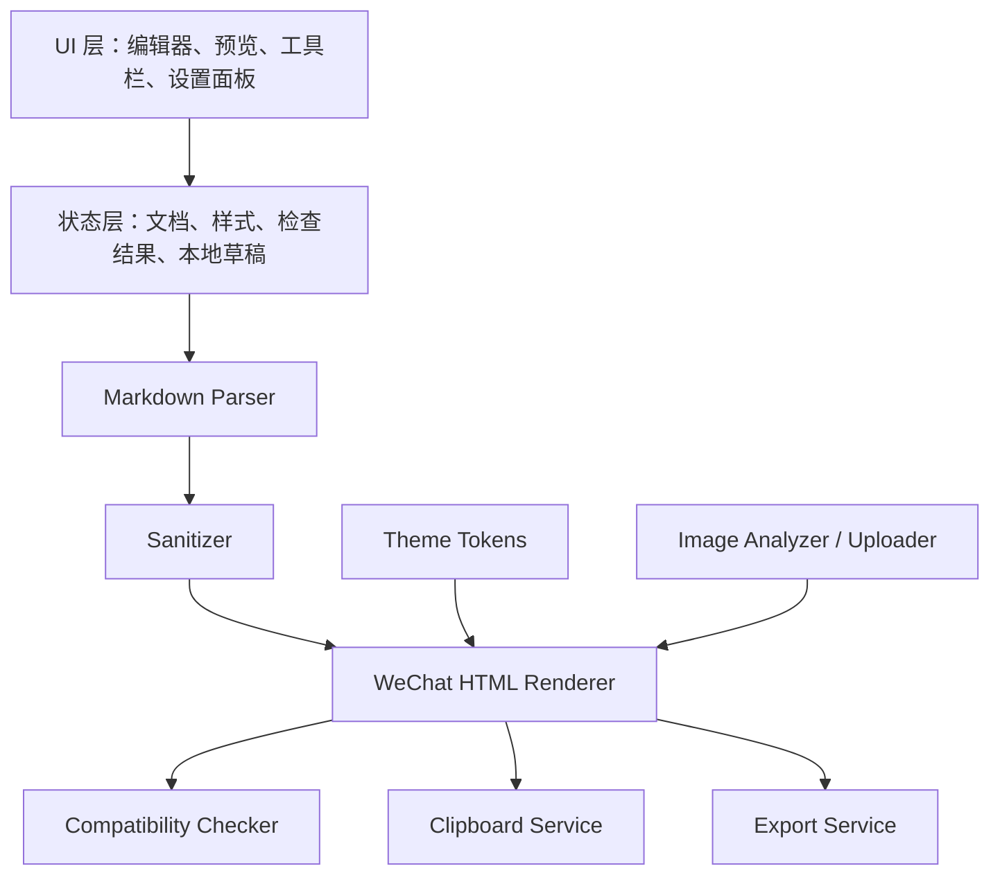

# Markdown 微信公众号排版工具 PRD

版本：v0.1  
日期：2026-05-27  
状态：产品与技术方案草案

## 1. 背景

创作者经常用 Markdown 写文章，但微信公众号后台使用富文本编辑器。直接粘贴 Markdown 原文会丢失标题、引用、代码块、表格等结构；直接粘贴普通网页 HTML 又可能被微信公众号编辑器过滤样式、图片和脚本。

本产品的目标是：用户输入或导入任意 Markdown 文档，网站实时渲染为适合微信公众号图文编辑器的富文本样式，并支持一键复制后粘贴到微信公众号后台，尽量保持排版一致。

## 2. 资料依据与关键约束

参考资料：

- 微信官方“新增草稿”接口文档：`content` 支持 HTML 标签；正文会去除 JS；图片 URL 必须来自“上传图文消息内的图片获取 URL”接口，外部图片 URL 会被过滤；标题、作者、摘要和正文均有长度约束。  
  https://developers.weixin.qq.com/doc/service/api/draftbox/draftmanage/api_draft_add.html
- 微信官方“上传发表内容中的图片”接口文档：服务端调用 `/cgi-bin/media/uploadimg`，返回图片 URL；图片仅支持 jpg/png，大小必须在 1MB 以下。  
  https://developers.weixin.qq.com/doc/service/api/notify/message/api_uploadimage.html
- 微信官方素材管理概览：图文消息内图片上传接口为 `/cgi-bin/media/uploadimg`。  
  https://developers.weixin.qq.com/doc/offiaccount/Asset_Management/Adding_Permanent_Assets.html

由此得到的产品约束：

- 复制到微信公众号编辑器的内容应以富文本 HTML 为核心，而不是纯 Markdown。
- 样式应尽量使用内联 CSS，避免依赖 `<style>`、class、CSS 变量、外部样式表或脚本。
- 渲染结果必须主动移除 JS、事件属性和不安全 HTML。
- 图片是最大不确定性：MVP 可保留远程图片并提示风险；若要稳定进入公众号，后续需要服务端接入微信图片上传接口。
- 公众号文章正文适合控制体积：需要统计字符数、HTML 大小、图片数量、标题/摘要长度，并给出兼容性提醒。

## 3. 产品定位

一句话定位：面向中文内容创作者的 Markdown 到微信公众号富文本排版与复制工具。

核心使用场景：

1. 用户在本地、Notion、Obsidian、Typora、GitHub 或 AI 工具中写好 Markdown。
2. 用户把 Markdown 粘贴到本网站。
3. 网站实时生成微信公众号风格预览。
4. 用户选择样式、调整排版细节。
5. 用户点击“一键复制”，到微信公众号图文编辑器中粘贴。
6. 用户在公众号后台补充封面、摘要、图片校验和最终发布。

## 4. 目标用户

- 公众号作者：需要把长文、教程、访谈、读书笔记快速排版。
- 技术作者：Markdown 中包含代码块、表格、引用、脚注、目录。
- AI 内容工作流用户：从 ChatGPT、Claude、Gemini 等工具生成 Markdown 后，希望快速粘贴到公众号。
- 团队运营：需要统一品牌色、标题样式和文章模板。

## 5. 产品目标

### 5.1 MVP 目标

- 支持粘贴 Markdown 并实时预览微信公众号风格排版。
- 支持一键复制富文本，粘贴到微信公众号后台后主体样式尽量保真。
- 支持样式库，MVP 至少提供 5 套内置样式。
- 覆盖常见 Markdown 元素：标题、段落、加粗、斜体、链接、图片、列表、引用、代码块、行内代码、表格、分割线。
- 提供微信公众号兼容性检查：HTML 体积、标题/作者/摘要建议、外部图片风险、可能被过滤的标签或样式。

### 5.2 非目标

- MVP 不直接发布公众号文章。
- MVP 不要求登录微信公众平台。
- MVP 不保存用户文章到云端。
- MVP 不做多人协作、审核流或内容管理系统。
- MVP 不承诺粘贴后 100% 像素级一致，因为微信公众号编辑器会过滤部分 HTML/CSS。

## 6. 成功指标

- 从粘贴 Markdown 到复制富文本，核心路径不超过 3 步。
- 常见 2000-5000 字文章渲染延迟低于 300ms。
- 复制后粘贴到微信公众号后台，标题、段落、引用、列表、代码块、表格的样式保留率达到可接受水平。
- 用户无需学习 HTML/CSS 即可完成排版。
- 兼容性检查能提前暴露外部图片、超长正文、危险 HTML 等主要风险。

## 7. 核心功能

### 7.1 Markdown 输入

功能：

- 支持直接粘贴 Markdown。
- 支持拖拽或选择 `.md` 文件导入。
- 支持从剪贴板读取内容。
- 支持保留当前文档和最近编辑内容到浏览器本地存储。

需求：

- 工作台采用左右双栏布局：左侧为可编辑 Markdown 原文，右侧为实时渲染预览。
- 输入内容变化后实时解析。
- 解析错误不阻塞编辑，显示可读错误提示。

### 7.2 微信风格实时预览

功能：

- 将 Markdown 渲染为微信公众号文章视觉宽度下的富文本预览。
- 支持 PC 编辑器近似预览和手机阅读宽度预览两种模式。
- 支持从样式库切换当前文档样式。

重点元素：

- `h1` 作为文章主标题或一级标题。
- `h2/h3` 使用适合公众号的分节标题样式。
- 段落保持较高行高，适合移动端阅读。
- 引用块可做浅色背景或左边线。
- 代码块需要可读，但不能依赖复杂脚本。
- 表格需要横向可读，必要时提示用户表格过宽。

### 7.3 一键复制

功能：

- 点击按钮复制富文本 HTML 到剪贴板。
- 同时写入 `text/html` 和 `text/plain` 两种剪贴板格式。
- `text/plain` 使用转换后的纯文本，作为不支持富文本复制时的降级内容。
- 复制后显示成功、失败或浏览器权限提示。

技术要求：

- 首选 Clipboard API：`navigator.clipboard.write([new ClipboardItem(...)])`。
- 降级方案：隐藏 contenteditable 容器 + `document.execCommand('copy')`。
- 复制前生成“微信兼容 HTML”：移除危险标签、转换为内联样式、清理空节点。

### 7.4 样式库与样式系统

目标：

- 用户可以从样式库中选择不同排版样式，右侧微信公众号预览立即切换成对应效果。
- 用户在选择样式前，可以通过样式卡片的缩略预览窗口快速判断大致效果。
- 样式既包含系统内置模板，也支持用户自定义生成和保存。

MVP 内置样式：

- 默认简洁：黑白灰，适合大多数文章。
- 科技教程：更强的代码块、步骤和表格样式。
- 深度文章：更强标题层级、引用和注释风格。
- 商务报告：标题克制、表格清晰、重点句突出。
- 轻量杂志：图片、引用和小标题更有视觉层次。

样式库功能：

- 样式面板以卡片网格展示所有样式。
- 每张样式卡片包含名称、适用场景、缩略预览和“应用”操作。
- 缩略预览使用一段固定示例 Markdown 生成，展示标题、正文、引用、列表、代码和表格的代表性效果。
- 鼠标悬停或点击样式卡片时，可显示更大的样式预览弹窗。
- 应用样式后，当前文档右侧预览立即重新渲染。
- 每篇文档记住自己的样式选择。
- 支持收藏常用样式。

样式配置项：

- 主色、强调色、正文颜色、弱文本颜色。
- 字号、行高、段落间距。
- 标题样式。
- 引用样式。
- 代码块样式。
- 图片说明样式。
- 表格样式。
- 分割线样式。
- 卡片/提示块样式。

自定义生成：

- 用户可以从现有样式复制生成一个新样式。
- 用户可以通过表单调整主色、字号、行高、标题样式、引用样式、代码块样式等参数。
- 用户可以输入风格描述生成样式草案，例如“适合科技长文，蓝绿色强调，代码块明显但不要太花”。
- 生成后的样式需要先进入预览状态，用户确认后保存到“我的样式”。
- 自定义样式保存为结构化 JSON，不允许保存任意 JS。

实现原则：

- 样式先定义为结构化 token。
- 渲染时将 token 映射为内联 CSS。
- 不允许用户自定义任意 JS。
- 样式缩略预览和正文预览使用同一套 renderer，避免预览与实际应用不一致。
- Post-MVP 可支持导入/导出样式 JSON、分享样式链接、样式市场。

### 7.5 兼容性检查

检查项：

- 正文 HTML 字符数和体积。
- 是否存在 `<script>`、事件属性、iframe、video、audio、form 等高风险元素。
- 是否存在外部图片、base64 图片或本地图片路径。
- 图片数量、图片格式、图片大小提示。
- 标题是否超过 32 个字、作者是否超过 16 个字、摘要是否超过 128 个字。
- 链接是否为普通外链，并提示公众号正文链接能力有限。
- 表格是否过宽。
- 代码块是否过长。

输出：

- 顶部状态：可复制 / 有警告 / 有阻断。
- 右侧检查面板展示问题列表。
- 每个问题给出原因和建议处理方式。

### 7.6 图片处理

MVP：

- 支持 Markdown 图片语法：``。
- 支持显示远程图片预览。
- 对本地路径图片、base64 图片给出警告。
- 复制 HTML 时保留远程图片 URL，但提示粘贴到微信公众号后可能被过滤或无法保存。

Post-MVP：

- 增加服务端微信图片上传能力。
- 用户配置公众号 AppID/AppSecret 或通过第三方平台授权。
- 服务端调用 `/cgi-bin/media/uploadimg`，把文章内图片替换为微信返回的图片 URL。
- 图片上传前自动压缩到 jpg/png 且小于 1MB。

### 7.7 导出能力

MVP：

- 复制富文本。
- 复制 HTML 源码。
- 下载 HTML 文件。
- 下载 Markdown 原文。

Post-MVP：

- 导出样式 JSON。
- 导出微信公众号草稿接口 JSON。
- 直接创建微信公众号草稿。

### 7.8 文档保存与组织

目标：

- 用户可以把多篇 Markdown 文档保存在网站内，按目录和标签整理，后续继续编辑、预览和复制。
- 第一版优先使用浏览器本地存储，不强制登录，不依赖云端。

MVP 功能：

- 新建文档、保存文档、重命名文档、删除文档。
- 文档自动保存，显示保存状态和最近保存时间。
- 支持目录管理：新建目录、重命名目录、移动文档到目录。
- 支持标签管理：给文档添加多个标签，按标签筛选。
- 支持文档列表搜索：按标题、正文关键字、标签搜索。
- 支持最近编辑、创建时间、更新时间排序。
- 支持未保存变更提醒，避免用户切换文档时丢失内容。

文档元信息：

- 标题：默认从 Markdown 第一个 `h1` 提取，也允许手动修改。
- 所属目录：默认放入“未分类”。
- 标签：用户手动添加，支持多标签。
- 摘要：可从正文自动截取，也可手动填写，用于公众号摘要检查。
- 样式：每篇文档可以记住自己使用的样式。
- 更新时间、创建时间、字数、图片数。

Post-MVP：

- 目录支持多级层级。
- 支持归档、收藏、批量移动、批量删除。
- 支持导入/导出整个文档库。
- 支持云端同步和多设备访问。
- 支持团队共享目录和权限管理。

## 8. 信息架构

首屏即产品，不做营销首页。

页面布局：

- 左侧文档库侧边栏：目录树、标签筛选、文档搜索、文档列表。
- 中间左栏 Markdown 编辑器：可直接编辑 Markdown 原文。
- 中间右栏微信公众号预览：实时渲染当前 Markdown 文档。
- 顶部工具栏：新建/保存、导入、样式库、预览模式、兼容性状态、一键复制。
- 右侧抽屉：样式库、样式设置、兼容性检查、导出选项。
- 底部状态栏：字数、HTML 大小、图片数、复制状态。

样式库交互：

- 点击顶部“样式库”打开右侧抽屉。
- 抽屉顶部展示当前文档正在使用的样式。
- 抽屉主体展示内置样式和“我的样式”卡片。
- 点击样式卡片先在卡片内或弹窗中展示缩略预览。
- 点击“应用”后，右侧文章预览立即切换到该样式。
- 点击“自定义生成”进入样式编辑/生成面板。

核心路径：



## 9. 技术架构

### 9.1 推荐 MVP 技术栈

- 前端框架：React + Vite + TypeScript。
- Markdown 解析：`unified` + `remark-parse` + `remark-gfm` + `remark-rehype`。
- HTML 处理：`rehype-sanitize` + 自定义 AST transformer。
- 代码高亮：`shiki` 或 `lowlight`，MVP 优先选择可生成静态 HTML 的方案。
- 样式内联：自定义 renderer 或 `juice` 类 CSS inline 方案；前端 MVP 可直接在 AST 渲染阶段写入 `style`。
- 编辑器：MVP 可用 `<textarea>`；Post-MVP 可升级 CodeMirror。
- 状态管理：React state + localStorage；暂不引入复杂状态库。
- 测试：Vitest 做转换器单测；Playwright 做复制和预览冒烟测试。

### 9.2 模块划分



建议目录：

```text
src/
  app/
  components/
    editor/
    preview/
    style-library/
    toolbar/
    inspector/
  lib/
    markdown/
      parseMarkdown.ts
      sanitizeHtmlAst.ts
      renderWeChatHtml.ts
    clipboard/
      copyRichText.ts
    compatibility/
      checkWeChatCompatibility.ts
    themes/
      defaultTheme.ts
      techTheme.ts
      essayTheme.ts
      styleSchema.ts
      previewSample.ts
  types/
```

### 9.3 数据模型

```ts
type DocumentState = {
  id: string;
  markdown: string;
  title?: string;
  author?: string;
  digest?: string;
  directoryId: string;
  tagIds: string[];
  styleId: string;
  previewMode: "desktop" | "mobile";
  createdAt: string;
  updatedAt: string;
  lastSavedAt?: string;
};

type StylePreset = {
  id: string;
  name: string;
  description: string;
  category: "built-in" | "custom";
  useCases: string[];
  tokens: StyleTokens;
  previewHtml?: string;
  isFavorite?: boolean;
  createdAt: string;
  updatedAt: string;
};

type StyleTokens = {
  colors: {
    text: string;
    muted: string;
    primary: string;
    accent: string;
    background: string;
    blockBackground: string;
    border: string;
  };
  typography: {
    bodyFontSize: number;
    bodyLineHeight: number;
    h1FontSize: number;
    h2FontSize: number;
    h3FontSize: number;
    codeFontSize: number;
  };
  spacing: {
    paragraphMargin: number;
    sectionMargin: number;
    blockPadding: number;
  };
  blocks: {
    headingVariant: "plain" | "bar" | "numbered" | "underlined";
    quoteVariant: "left-border" | "card" | "highlight";
    codeVariant: "light" | "dark" | "terminal";
    tableVariant: "grid" | "zebra" | "minimal";
  };
};

type Directory = {
  id: string;
  name: string;
  parentId?: string;
  createdAt: string;
  updatedAt: string;
};

type Tag = {
  id: string;
  name: string;
  color?: string;
  createdAt: string;
  updatedAt: string;
};

type DocumentLibraryState = {
  documents: DocumentState[];
  directories: Directory[];
  tags: Tag[];
  styles: StylePreset[];
  activeDocumentId?: string;
  activeDirectoryId?: string;
  activeTagIds: string[];
  searchQuery: string;
};

type RenderResult = {
  html: string;
  plainText: string;
  stats: {
    markdownChars: number;
    htmlChars: number;
    htmlBytes: number;
    imageCount: number;
    linkCount: number;
  };
  warnings: CompatibilityIssue[];
};

type CompatibilityIssue = {
  severity: "blocker" | "warning" | "info";
  code: string;
  message: string;
  suggestion: string;
  nodePath?: string;
};
```

## 10. 微信兼容 HTML 策略

允许的基础标签：

- `section`, `p`, `span`, `strong`, `em`, `br`
- `h1`, `h2`, `h3`, `h4`
- `blockquote`
- `ul`, `ol`, `li`
- `pre`, `code`
- `table`, `thead`, `tbody`, `tr`, `th`, `td`
- `img`
- `a`
- `hr`

清理策略：

- 移除 `script`, `style`, `iframe`, `object`, `embed`, `form`, `input`, `button`, `video`, `audio`。
- 移除所有 `on*` 事件属性。
- 移除 `javascript:` 链接。
- 移除 CSS 中的 `position: fixed`、复杂动画、外部资源、CSS 变量。
- 将 class-based 样式转换为内联样式。
- 尽量避免 flex/grid 等在粘贴环境中不稳定的布局。

样式策略：

- 容器使用 `section`。
- 主要排版依赖 `font-size`, `line-height`, `color`, `margin`, `padding`, `border`, `background`, `border-radius`, `text-align`。
- 图片使用 `max-width: 100%; display: block; margin: ...`。
- 代码块使用简单背景、等宽字体、换行策略，不依赖 JS。
- 表格使用内联边框、单元格 padding 和字号。

## 11. 版本规划

### Phase 1：本地 MVP

交付：

- React + Vite 应用初始化。
- Markdown 输入和实时预览。
- 样式库：至少 5 套内置样式、样式卡片缩略预览、应用后右侧实时切换。
- 微信兼容 HTML renderer。
- 一键复制富文本。
- 兼容性检查基础版。
- 本地文档库：保存多篇文档、目录、标签、搜索、自动保存。

验收：

- 粘贴一篇包含标题、列表、引用、图片、代码、表格的 Markdown，能生成预览并复制。
- 复制到微信公众号后台后，主体排版可用。
- 外部图片、危险 HTML、超长内容能给出警告。
- 新建 3 篇文档，分别放入不同目录并添加标签，刷新页面后仍能恢复和筛选。
- 选择不同样式时，样式卡片能展示缩略预览，应用后右侧文章预览能立即切换。

### Phase 2：增强排版与样式

交付：

- 样式参数可视化调整。
- 自定义生成样式并保存到“我的样式”。
- 更多文章模板：访谈、教程、产品更新、论文笔记、读书笔记。
- 目录、脚注、数学公式降级渲染。
- 更完整的表格和代码块处理。
- HTML 源码导出和导入。

### Phase 3：图片与微信 API

交付：

- 服务端模块。
- 微信 access_token 管理。
- 图片压缩与上传到 `/cgi-bin/media/uploadimg`。
- 替换文章内图片 URL。
- 可选创建公众号草稿。

注意：

- 微信接口应在服务端调用，不能把 AppSecret 暴露在浏览器端。
- 需要处理 token 缓存、IP 白名单、权限集、上传失败重试和用户隐私。

## 12. 关键风险

- 微信公众号编辑器会持续调整过滤规则，粘贴保真不能完全由本产品控制。
- 外部图片在公众号后台可能被过滤，MVP 只能提示，不能保证。
- 复杂 HTML/CSS 如多栏布局、动画、交互组件不适合进入公众号正文。
- 代码高亮和表格容易造成 HTML 体积膨胀，需要控制样式复杂度。
- 直接接入公众号 API 涉及密钥、授权和合规，必须放在服务端并做好隔离。

## 13. 待确认问题

- 第一版是否只服务微信公众号，还是同时支持知乎、掘金、飞书文档等目标平台？
- 是否需要默认文章元信息输入：标题、作者、摘要、原文链接？
- 样式风格是偏品牌化，还是偏通用排版工具？
- 样式自定义生成第一版是否需要 AI 生成，还是先做参数化编辑器？
- 样式缩略预览是否使用固定示例文案，还是使用当前文档前几段生成预览？
- 文档保存第一版是否只做浏览器本地存储，还是需要从一开始支持云端同步？
- 目录第一版是否需要多级目录，还是一级目录加多标签已经足够？
- 是否需要支持数学公式？如果需要，公式在公众号里应转为图片还是静态 HTML？
- 是否需要账号系统和云端草稿，还是坚持本地优先？

## 14. 推荐下一步

先实现 Phase 1。原因是核心价值在“粘贴 Markdown -> 复制微信公众号富文本”这一条路径，图片上传和草稿箱发布虽然重要，但会显著增加服务端、授权和微信配置成本，适合在本地复制体验验证后再做。
