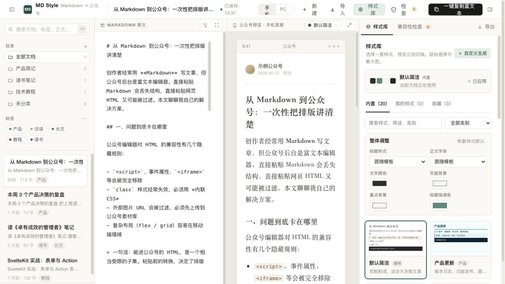

# MD Style

把 Markdown 文章转换成适合微信公众号编辑器粘贴的富文本排版工具。

MD Style 是一个本地优先的 Markdown 排版编辑器：左侧编写或粘贴 Markdown，右侧实时预览公众号文章效果，选择不同样式模板后，一键复制为带格式的富文本，再直接粘贴到微信公众号后台或其他富文本编辑器中。

它主要解决三个问题：

- Markdown 原文粘贴到公众号后台会丢失结构和样式。
- 公众号编辑器对 HTML 和 CSS 兼容性有限，复杂样式需要转换成更稳的内联格式。
- 多篇文章、多个样式模板和本地草稿需要统一管理。

适合公众号作者、内容团队、课程讲义作者、Newsletter 作者，以及经常用 Markdown 写作但需要发布到富文本平台的人。

## 截图



## 运行

```bash
npm run dev
```

然后打开：

```text
http://localhost:4173/index.html
```

## 桌面 App

开发模式运行：

```bash
npm run app
```

打包 macOS `.app`：

```bash
npm run package
```

本机架构的 `.app` 会输出到：

```text
release/mac-arm64/MD Style.app
```

打包 macOS `.app` 与 `.dmg`：

```bash
npm run dist
```

分别打包 Apple Silicon 与 Intel Mac：

```bash
npm run dist -- --arm64 --publish never
npm run dist -- --x64 --publish never
```

在 Windows 主机打包安装版和便携版 `.exe`：

```bash
npm run dist:win -- --x64 --publish never
```

推送 `v*` 标签时，GitHub Actions 会自动构建并发布：

- macOS Apple Silicon / Intel `.dmg`
- macOS Apple Silicon / Intel `.zip`，解压后为 `.app`
- Windows x64 安装版 `.exe`
- Windows x64 便携版 `.exe`

当前公开构建未配置 Apple Developer ID 或 Windows 代码签名证书，因此系统首次打开时可能显示安全提示。

App 图标资源：

```text
assets/app-logo.png
assets/app-icon.icns
assets/app-icon.ico
```

主要代码结构：

```text
index.html              页面结构与前端资源装配
assets/app.css          工作台、文档库与响应式基础样式
assets/app.js           前端状态协调、交互绑定与视图渲染
assets/markdown-it.min.js 本地打包的 Markdown 解析器
assets/markdown-engine.js Markdown 增强识别、URL 清洗与 HTML 渲染
assets/library-model.js 文档库初始状态、数据校验与版本兼容迁移
assets/wechat-exporter.js 微信公众号富文本样式内联与 DOM 清洗
assets/theme-catalog.js  内置主题元数据、缩略图与结构校验
assets/themes.css        内置主题和文档级样式覆盖
electron/main.js         Electron 主进程、窗口与安全策略
electron/preload.js      受限剪贴板和文档存储桥接
electron/library-storage.js 原子保存、备份轮换与安全快照
scripts/smoke-tests.mjs  模块、迁移与安全回归测试
scripts/storage-tests.mjs 存储可靠性测试
scripts/verify-copy-export.mjs Electron 富文本复制集成测试
```

## 测试

```bash
npm test
```

测试会检查各前端模块语法、Electron 主进程/preload 语法、Markdown/URL/颜色清洗、复制导出关键规则、状态迁移、原子备份和整库导入导出入口。

完整验证富文本内联样式与最终导出体积：

```bash
npm run test:copy
```

## License

MIT

## 已实现

- 左侧 Markdown 可编辑，右侧公众号样式实时预览。
- 本地文档库，支持目录、标签、搜索、排序、自动保存。
- 样式库，支持内置样式、收藏、缩略预览、悬浮大预览、应用后实时切换。
- 自定义生成样式并保存到“我的样式”。
- 一键复制富文本到剪贴板。
- 复制 HTML 源码、下载 HTML、下载 Markdown。
- 导出/导入完整文档库 JSON，用于本地备份和迁移。
- 导入前自动创建安全快照，并支持恢复导入前文档库。
- 兼容性检查：危险 HTML、图片、表格、代码块、标题长度、HTML 体积。
